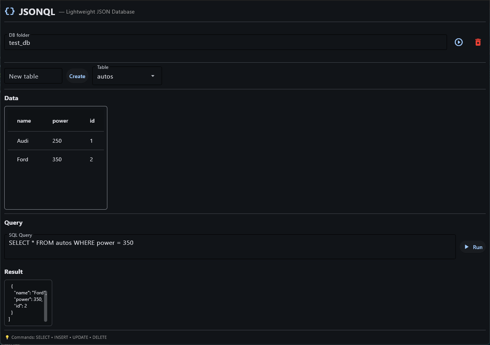

# JSONQL — Lightweight JSON Database

> **SQLite, but with JSON files.**  
> A simple, transparent, file-based database for local apps, prototypes, and edge devices.

[](https://pypi.org/project/jsonql/)
[](LICENSE)

✅ **No server** • ✅ **No setup** • ✅ **Just JSON files**  
✅ **SQL-like queries** • ✅ **Thread-safe** • ✅ **< 300 lines core**

> ⚠️ **Not related to** [`json-ql`](https://pypi.org/project/json-ql/) (PyPI) or [`jsonql.js.org`](https://jsonql.js.org) — those are **JSON query tools**, not databases.


---

## Install

``` bash
    pip install jsonql


For the GUI browser (Flet-based):
``` bash
    pip install "jsonql[browser]"

Quick Start

    import jsonql

    db = jsonql.connect("my_data")  # creates my_data/ folder

    # Insert
    db.insert("devices", {"name": "Projector", "room": "A101"})

    # Query
    print(db.select("devices", {"room": "A101"}))

    # SQL-like
    print(db.query("SELECT * FROM devices WHERE room = 'A101'"))

GUI Browser
``` bash
    python -m jsonql.browser



Why JSONQL?

Feature	            SQLite	                JSONQL
Storage             format Binary	        Human-readable JSON
Setup	            Install required	    Zero install (pure Python)
Transparency	    Opaque	                Everything is a file
Ideal for	        Heavy apps	            Lightweight tools, AV, IoT, prototypes


License
MIT — see LICENSE


```python
    # demo.py
    import jsonql

    def main():
        db = jsonql.connect("demo_db")
        
        # Insert
        dev_id = db.insert("devices", {
            "name": "Epson L710U",
            "type": "projector",
            "room": "A101",
            "ip": "192.168.10.50"
        })
        print(f"✅ Inserted device ID: {dev_id}")

        # Select
        devices = db.select("devices", {"room": "A101"})
        print("🔍 Devices in A101:", devices)

        # SQL Query
        result = db.query("SELECT * FROM devices WHERE type = 'projector'")
        print("💻 SQL Result:", result)

    if __name__ == "__main__":
        main()
